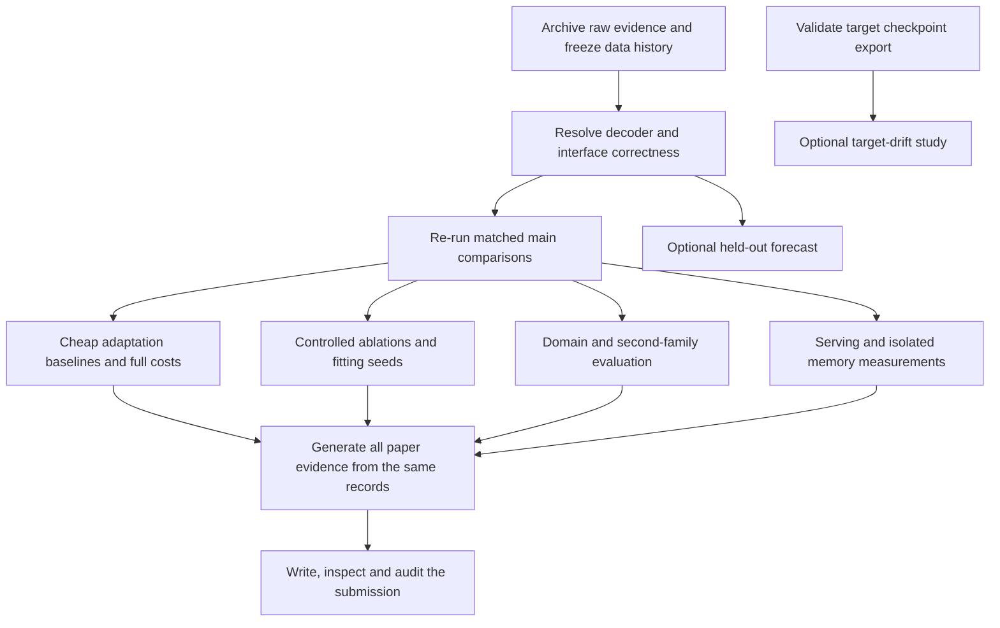

# RelaySpec evidence and execution plan

**Goal:** establish a reproducible, technically correct paper about adapting existing frozen speculative drafters to new targets at low marginal cost.

**Architecture:** retain the frozen target and drafter, fit the connector to the exact input each drafter consumes, and leave final token verification with the target. Research evidence flows from immutable request records through one aggregation pipeline into the paper.

**Tools:** the existing Python/PyTorch implementation, pinned DFlash and DeepSpec integrations, versioned JSON/YAML protocols, CPU tests, paired GPU evaluations, and the ICLR 2027 LaTeX manuscript.

Date: 5 September 2026. This expands the [initial repair plan](2026-09-05-iclr-submission-repair-plan.md), using the [42-review study](../research/2026-09-05-openreview-review-study.md) and [repository/paper audit](../../reports/ICLR_SUBMISSION_REVIEW_2026-09-05.md). **The work below is planned, not completed. No GPU jobs were launched while preparing this plan.** A new passing planning check validates organization, not research results.

## 1. The scientific question and present status

An existing drafter expects features from its original source model. Running that source costs time and memory. RelaySpec learns to supply a compatible input from the new target instead. The practical question is: **how much useful acceleration can we retain, at what new fitting cost, while removing the source transformer from the deployed decoding path?**

Current strengths are two different drafter integrations, substantial paired measurements, memory experiments, and a simple implementation. Current blockers are target-output agreement, mismatched mathematical descriptions and ablations, incomplete latest raw artifacts, and missing cheap-adaptation comparisons. More benchmark rows cannot repair those blockers.

Recorded main request-time ratios against plain target decoding are about 2.40–5.14, and against source reuse about 1.10–1.53. They are promising **unvalidated headline evidence**, not a guarantee of the final result. Several native-drafter controls also disagree with plain decoding, so the present mismatch cannot be attributed to the connector alone. See R1 in the audit for exact counts.

## 2. Work order and result gates



The main path is E00–E12, E14, E16–E18 below. E13 is needed only for a forecasting claim; E15 only for a drift/online claim. E03 fixes and tests the exporter even if the expensive drift study is postponed. Do not make the optional studies dependencies of the static paper.

An unfavorable result is a completed experiment if it is valid and fully reported. A run is not complete merely because the scheduler exited successfully. Completion requires the listed evidence, recorded interpretation, and review of relevant correctness checks. The machine-readable [task ledger](../../configs/submission/plan.json) records dependencies and expected completion records. It does not overwrite the historical experimental protocol.

## 3. Data, comparisons and measurement contract

### Separate five data roles

1. **Fitting data:** examples used to learn connector weights. Record distinct IDs, text hashes, whether solutions are included, total token presentations, and truncation.
2. **Calibration data:** requests used to measure hardware costs or choose a deployment rule.
3. **Development data:** requests used to select layers, normalization, architecture, update count, or hyperparameters.
4. **Historical evaluation:** previously examined benchmarks, including already inspected MATH-500 subsets. Keep their results, but do not rename them untouched tests.
5. **New final evaluation:** a versioned set whose outputs were not used for the new selection decisions. Freeze its IDs and hashes before running the selected method.

Audit all existing selection reports before choosing the final set. A random re-split of data already inspected does not restore independence. Use an unused official split or a newly frozen, documented workload if available; check train/evaluation near duplicates, including solutions. If no untouched set is feasible, explicitly describe the evidence as retrospective validation and restrict generalization claims. Never select the new workload by pilot speed.

### Keep two kinds of baseline comparison

**Controlled mechanism comparison:** identical target revision, precision, attention backend, prompt template, stopping, draft budget/search topology, and measurement code. Arms: plain target decoding; optimized source reuse; RelaySpec; available native target drafter; inexpensive adaptation variants.

**Deployment comparison:** allow each implementation its supported useful search policy, selected using the same development budget, inside the same serving engine and hardware setting. Report chain versus tree, token budget, concurrency, and resident models. A chain-only comparison cannot establish superiority over a baseline whose practical strength is tree drafting.

Do not import another paper's speed ratio into the comparison table as though it were measured here. If a checkpoint or method is unavailable, mark it unavailable with a reason. If adapting an external method changes its scientific design, name it as an adaptation/ablation and retain a separate faithful setting where feasible.

### Save enough information to recompute each result

Each run needs a stable run ID; repository commit and dirty-diff hash; config and manifest hashes; model and upstream revisions; GPU/driver/library versions; seed; worker/rank; method order; warmup exclusion; prompt ID; input/output token IDs; decoded text; stop reason; token count; request time; prefill/decode breakdown when measured; accepted draft-token count and target correction/bonus count separately; peak allocated/reserved memory; and scorer version/result. Trace collection must be separate from timed runs if it changes timing.

Use one fresh output directory per run. Archive rank-level records and the merge report; detect duplicate/missing requests and failed arms before aggregation. Preserve failures and timeouts with a declared reporting policy instead of dropping slow cases.

### Define metrics before computing them

The request-time ratio asks how much faster the complete workload finishes. Divide the sum of baseline request times by the sum of candidate request times. A value of 1.20 means the baseline needed 20% more time; equivalently, the candidate saved about 16.7% of baseline time. It does not mean a 20% time reduction.

Tokens per second asks how many generated target tokens were produced per timed second. Divide total generated target tokens by total corresponding time. If output lengths differ, its ratio is not equal to the request-time ratio. Report both, plus lengths and task quality. Use actual outputs for end-to-end measurements; use forced common prefixes only for diagnostic kernel/cycle comparisons, with that distinction explicit.

Use paired request resampling for confidence intervals; resample a whole two-turn conversation together. Keep the existing 95% interval, 10,000 resamples and seed 1729 for continuity. These describe workload variation. Report variation between separately fitted connectors separately. Do not pool repeated execution or fitting seeds as independent new prompts.

For task accuracy, score the same outputs whose speed is reported. Report paired difference and uncertainty. The existing one-percentage-point quality tolerance is not established by a point estimate alone: a non-inferiority claim needs its confidence bound within the declared tolerance and enough data. Mathematical output preservation, observed token equality, and task accuracy are three different claims.

## 4. Exact repair and experiment tasks

### E00 — Recover and identify the headline evidence

**Files:** `reports/final/MAIN_PAIRED_AR.json`, `reports/final/`, `scripts/merge_benchmark_runs.py`, `reports/submission-review-2026-09-05/`.

Retrieve the rank-level inputs/outputs, configs, source snapshots and checkpoint identities behind jobs 27357, 27325, 27396 and 27397 and every transfer headline. Compare hashes against summaries. Produce a run-to-table ledger and a missing-artifact list. Summaries alone cannot satisfy a raw-record requirement. Keep earlier snapshots unchanged.

**Done when:** every retained headline has reconstructible provenance, or is explicitly quarantined pending a replacement run. Later E05 must replace quarantined core rows before submission.

### E01 — Establish decoder correctness before speed claims

**Files:** `src/relayspec/generation.py`, `cache.py`, `proposers.py`, `eagle3.py`, `vocab_bridge.py`; both benchmark scripts; `scripts/audit_mismatches.py`; relevant generation/cache tests. Add `scripts/trace_first_divergence.py` and corresponding targeted tests as implementation work.

1. On CPU toy models, exhaustively test accepted prefixes, rejection at every position, all-accepted bonus tokens, early end-of-sequence, max-token truncation, and cache rollback. Assert target-greedy outputs match an independent simple reference.
2. Trace representative existing mismatches across source reuse, relay and native drafters. At the **same prefix**, compare target scores, selected token, position IDs, masks, cache lengths and next-token indexing. Comparing scores after prefixes diverge cannot identify the first cause.
3. Separate prompt/stopping errors, cache/mask/index defects, tokenizer conversion errors, and numerical score-order changes. Investigate numerical explanations with controlled precision/backend experiments and top-two score margins. Do not dismiss a large mismatch rate as rounding without evidence.
4. After fixes, run a 32-request diagnostic pilot spanning the observed failure categories, then the full declared suite. This pilot is development data. Keep any numerical differences under a documented contract; exact mathematical guarantees still require a correct algorithm.
5. Test cross-vocabulary handling separately: special tokens, context-sensitive token boundaries, round-trip conversion, empty intersections and cache updates. If unresolved, leave that extension out of central claims.

**Done when:** all known mismatch categories have evidence and fixes/precise explanations; algorithm tests pass; current-run quality is measured; the paper states exactly which equality claim is supported. No unexplained systematic mismatch may support a drop-in lossless claim.

### E02 — Match equations and accounting to implemented interfaces

**Files:** `src/relayspec/relay.py`, `proposers.py`, `losses.py`; `scripts/train_relay.py`, `fit_relay_closed_form.py`; `configs/protocol_active/`; manuscript Method and appendix.

Trace the actual teacher tensor and predicted tensor into the loss. DFlash applies the drafter's output normalization; selected EAGLE-3 uses the scale-preserving linear interface. Document masks, token/prompt averaging, denominator stabilizers, regularization, bias and optimizer for each experiment. Add tiny tensor tests for the loss actually used, including its gradient.

The current closed-form fit solves a raw linear regression problem, not the normalized-output DFlash objective. Keep it as a named surrogate, or construct a genuinely matched unnormalized comparison. Verify the raw least-squares residual/gradient numerically with the same weighting and regularization. Do not claim a closed-form solution to the nonlinear normalized objective.

Compute parameter counts from saved state dictionaries. Correct 4,096 distinct examples versus 8,192 presentations, the 524,288,000-weight transfer adapter, its SGD setting, and the reversed EAGLE normalization comparison. Separate warm fit-loop time from complete loading-to-deploy time, and inherited training from new-target fitting.

**Done when:** a tensor-contract table and accounting report agree with code, configs, checkpoints and paper; all R2/R3/R4/R9 factual repairs have exact sources.

### E03 — Repair target checkpoint export

**Files:** `scripts/lora_sft_drift.py:save_merged_checkpoint`; add a small export/reload regression test.

Save the adapter and export from an independent correctly merged/unwrapped model, using the supported `merge_and_unload` workflow for the pinned PEFT version. Avoid mutating the live distributed training model during export. Test zero-training identity first, then a nonzero adapter against its in-memory reference. Plain-model reload must have no unintended missing/unexpected keys, with checked scores and outputs. Audit actual historical remote checkpoints; a local reproducer does not prove every old checkpoint was corrupted.

**Done when:** both export cases pass and historical drift artifacts are marked valid or invalid individually. Invalid exports are never interpreted as scientific drift.

### E04 — Freeze the amended protocol and data history

**Files:** `configs/relayspec_protocol.yaml`, `docs/research/relayspec-decision-register.md`, existing manifests, `scripts/audit_prompt_similarity.py`. Create `configs/submission/protocol-v2.yaml` and hashed split manifests during execution.

Record exposure history and every change from the old protocol. Preserve historical files; do not retroactively call newly chosen settings preregistered. Audit near-duplicates using the actual token-set overlap measure, manually inspect flagged pairs, and freeze a clean sensitivity subset. Define score handling for timeouts and truncated outputs before results.

**Done when:** fitting/calibration/development/final roles are unambiguous; counts and hashes are checked; decisions are frozen before dependent comparisons.

### E05 — Re-establish the four main paired comparisons

**Starting configs:** selected DFlash and EAGLE-3 fits in `configs/protocol_active/`, their 8B/14B paired benchmarks, and `configs/breadth_ar/`. Copy amended configs into `configs/submission/runs/`; record the patch from each historical config.

Use the existing Qwen3-4B source drafters on Qwen3-8B and 14B targets, with all compatible baseline arms. Native DFlash-14B is currently absent; availability must be verified rather than assumed. Retain MATH-500 for historical comparability, labeled according to exposure, and add the final set from E04. Save current outputs for scoring. Rotate method order per request, exclude warmups, synchronize timed GPU regions, and avoid competing jobs on a timed GPU.

**Done when:** the full main matrix has raw outputs, quality, lengths, agreement, times, accepted-prefix statistics and uncertainty; every denominator is explicit. A missing arm stays visibly unavailable.

### E06 — Test the main novelty against inexpensive alternatives

**New work:** baseline adapters around `scripts/train_relay.py`, `src/relayspec/lora.py`, and the pinned external implementations. Reuse benchmark drivers for common measurements.

Start with one 8B case per drafter family. Compare:

- RelaySpec with a frozen drafter.
- A connector plus a small drafter update, initialized from the same inherited drafter. Charge connector initialization and drafter updates to its total adaptation budget.
- A compatible direct input-fusion-only update. Check algebraic equivalence first: where this is simply the relay folded into a linear fusion, report it as an implementation-equivalence control, not an independent competitor or new method.
- A faithful SD² frozen-steering setting, including the source model it needs at inference. If not compatible with this head, use a documented common supported model setting; do not label a different invented head as SD².
- An available target-independent PARD checkpoint in a supported common-target setting. Charge its inherited training once and its actual new-target cost, which may be zero. Do not impose RelaySpec's training needs on it.
- Available native target drafters as a performance reference, with their inherited cost labeled separately.

For trainable alternatives, compare at one-quarter, one and four times the measured baseline RelaySpec fitting budget. These are design budgets, not guaranteed runtimes. Provide both equal-data and equal-measured-compute views, since different methods process examples at different speeds. Give each trainable family the same small development tuning budget and report search cost. Use identical feature-extraction caching policy or charge its construction/storage explicitly.

**Done when:** a cost-versus-speed plot and resource table establish where the relay is competitive. If a cheap update dominates it, report that result and narrow the frozen-drafter advantage to a demonstrated constraint or revisit the method. Do not omit the winning competitor.

### E07 — Separate more data from more updates

**Files:** `configs/protocol_next/train_dflash_qwen3_8b_scale*_4gpu.yaml`, training sampler/accounting, new amended run configs.

On a representative DFlash pair, vary distinct records over 512, 1,024, 2,048 and 4,096 while holding updates at 1,024; separately vary 256, 512, 1,024 and 2,048 updates at 4,096 records. Record actual token presentations and sampling/repetition policy. The shared point means seven distinct configurations, with three seeds at the shared selected point through E14. Replicate the main trend on EAGLE if it supports a cross-family data claim. Add 8,192 distinct records only with a real expanded manifest and renewed overlap audit.

**Done when:** curves separately answer whether varied examples or extra optimization helped. Do not extrapolate a scaling law from a short local sweep.

### E08 — Test complexity fairly

**Files:** `src/relayspec/relay.py`, `scripts/train_relay.py`; new capacity configs and tests.

Compare dense linear, two-factor linear, and two-factor nonlinear maps using the same intermediate widths, initially 256 and 512. “Width” is the number of intermediate values carried between the two matrices. At width 512, the existing nonlinear map has about 11.8M weights versus 52.4M for the 8B dense linear map; this cannot alone establish that nonlinearity hurts. Match output normalization and train/development budgets.

For a promising nonlinear extension, start from a fitted linear map and add a zero-initialized small residual branch. It begins with exactly the original function, so deterioration is not merely a bad initial interface. Compare against an equal-budget linear update and a matched-size nonlinear bottleneck. Charge its initialization and extra inference operations.

**Promotion rule:** add complexity to the proposed method only if it improves held-out end-to-end time or materially reduces memory/fitting cost at acceptable quality across both representative drafter families. Set any practical improvement threshold using deployment needs and pilot measurement noise before final testing, not after seeing a favorable number. Otherwise report the ablation and retain the linear method.

### E09 — Explain why the relay works without claiming a universal basis

**Files:** `scripts/analyze_relay_manifold.py`, `src/relayspec/metrics.py`, new held-out interface probes.

Compare fitted features against random maps, shuffled teacher/example pairing, and simple matched-dimension input controls. Apply controls only in controlled probes; never use them to bypass target verification. On common prefixes, measure feature error, drafter token disagreement relative to source-conditioned drafting, first rejection position, accepted prefix length, and actual cycle time. Examine both in-domain and unseen-domain records. A low feature error with poor acceptance is an informative failure of the training surrogate.

Optional local explanation: if a small feature perturbation changes every drafter token score by less than half the gap between its highest and second-highest scores, its top choice stays the same. This follows because the leading score can move down and its competitor up by that amount. It explains why errors near small score gaps matter. It is a statement about the drafter at a fixed prefix, **not** proof that its choice equals the target's, or that a global bound is tight. Add formal bounds only if their assumptions and measurements add insight beyond this observation.

**Done when:** descriptive geometry is separated from behavioral evidence. No shared-semantic-basis claim rests on connectors trained toward the same teacher.

### E10 — Complete breadth and expose the useful operating range

**Files:** `configs/breadth_ar/`, `scripts/build_breadth_paired_ar.py`, code/math scoring tools.

Keep the existing math, coding and chat suite, with current-run plain-target controls. Run a new unexposed domain from E04 with the frozen selected relay. At minimum retain all known 14B coding regressions against source reuse. For chat, preserve each method's own conversation history and evaluate both turns; use common-prefix probes separately. Use deterministic task scorers where available. Any judge-based quality evaluation needs a pinned judge/prompt, blinded randomized ordering, cost accounting and a stated limitation.

**Done when:** the paper shows every planned task cell, including uncertainty and regressions, and distinguishes speed versus source reuse from speed versus plain target decoding. A lower acceptance length with higher speed is not a contradiction when the cycle becomes sufficiently cheaper.

### E11 — Validate transfer with the intervention named correctly

**Files:** transfer configs in `configs/protocol_next/`, transfer registries, `scripts/build_transfer_figures.py`, `vocab_bridge.py`.

Prioritize a clean second-family replication (existing Llama-source drafter to Llama target) and the unchanged-map Nemotron descendant test. Separate these from newly fitted cross-target adapters and Qwen-to-Llama vocabulary conversion. For each row list exactly which drafter/map is reused, which weights are trained, whether token conversion occurs, data and cost, and current target-quality/agreement evidence.

For the 524M adapter, compare against a direct new map before claiming an economical reuse advantage. A rank-restricted adapter may be explored under E08's cost rules. Cross-tokenizer transfer remains secondary until E01 validates it; retain an unsuccessful validated row as a boundary, not an implementation success.

**Done when:** at least a valid second-family test supports any architecture-generality claim; transfer labels cannot imply that all rows reuse one unchanged map.

### E12 — Measure the deployed system and its costs

**Files:** `src/relayspec/profiling.py`, `benchmarking.py`, isolated-memory configs; add a pinned SGLang or vLLM integration only after a compatibility pilot.

1. Measure each method in its own process for peak memory and resident components. Confirm the source transformer is actually absent from the RelaySpec process. The existing mixed-arm timing process is unsuitable as proof of source removal.
2. Record loading, feature extraction, fitting, checkpoint writing, reload and first successful request. Report cold setup separately from steady-state serving; do not sum GPU-seconds into wall seconds.
3. On one representative pair, run the same engine/target at concurrency 1, 4, 8 and 16 if memory permits. Concurrency means simultaneously active requests. Fix prompt and output-length distributions, and measure total throughput plus median and 95th-percentile request latency. Mark out-of-memory configurations explicitly.
4. Test input-length strata near 256, 2,048 and 8,192 target tokens within model limits, using fixed manifests. Avoid silently presenting truncation as long-context success. Keep engine-specific tuning and CUDA graph/memory settings visible.

**Done when:** absolute times, memory, cost boundaries and engine support are reproducible. If the engine integration cannot be completed, label the paper a measured batch-one PyTorch study and remove production-serving claims; this materially weakens the strong target version.

### E13 — Optional prospective deployment decision

**Files:** `src/relayspec/cost_model.py`, `gates.py`, `scripts/build_breadth_matrix.py`; new calibration/test manifests.

The existing same-run reconstruction remains an observed-cost explanation. To predict, measure candidate cycle costs and accepted progress on calibration requests only; freeze a rule that chooses the relay or a baseline; then evaluate unseen tasks/requests. Report wrong choices and extra time relative to the best fixed policy. The hindsight-best method is an analysis reference, not a deployable policy. Include calibration and switching overhead. A fallback to source reuse retains or reloads the source; use plain-target fallback if permanent source removal is required, and remeasure that system.

**Done when:** no test outcomes enter calibration and the policy beats a relevant fixed policy under its full costs; otherwise present a failed or inconclusive forecast and keep only the accounting analysis.

### E14 — Measure fitting stability

**Files:** amended training configs and aggregation code.

Use seeds 1729, 1730 and 1731 for representative DFlash-8B and EAGLE-8B fits under identical data/settings. These are reproducibility choices, not favorable seeds. If E05 already produced the 1729 checkpoint under the same amended protocol, only four extra fits are needed. Report each seed's speed/quality and mean/range separately from request confidence intervals. Expand to 14B if instability affects a main conclusion. Do not select the best seed for final headline reporting.

**Done when:** the benefit's dependence on fit randomness is known. Three seeds support a stability check, not a precise universal variance estimate.

### E15 — Optional drift study after valid exports

**Files:** `scripts/lora_sft_drift.py`, drift configs, new current-output scoring.

Only after E03, evaluate unchanged source reuse, old relay, refitted relay and a cheap drafter update against a controlled target-checkpoint sequence. Track target task quality, score/output changes, acceptance and timing together. A source-reuse collapse indicates more than a connector mismatch may be involved. Keep static descendant transfer distinct from continuous online adaptation.

An actual reinforcement-learning extension additionally requires a complete training baseline, matching sampling, comparable reward/quality at equal compute, end-to-end update overhead and comparison with FastGRPO/OnlineSPEC/SpecRoll. Postpone this if the static paper is not already complete. Do not turn the current invalid-export observations into a central negative or positive claim.

### E16 — Make evidence regenerate the paper end to end

**Files:** `scripts/build_iclr_paper_assets.py`, `build_transfer_figures.py`, aggregation/scoring modules, `reports/final/`, `paper/iclr2027/generated/`, `Makefile`.

Implement one validated run registry pointing to hashed raw artifacts. Compute quality and timing summaries from it. Make table values, graph coordinates, error bars and labels consume the same derived objects. Add semantic checks for baseline, units, request counts, checkpoint and run ID; missing raw evidence must prevent publishing a headline. Keep historical summaries as history. Add a small-weight-free artifact bundle that reproduces every main table and figure from a clean checkout.

**Done when:** a clean offline artifact command regenerates every main number and figure, and tests detect a deliberately mismatched run/label fixture. A hand-copied CSV is not the source of truth.

### E17 — Rewrite the manuscript from the validated claims

**Files:** `paper/iclr2027/relayspec_iclr2027.tex`, `references.bib`, generated artifacts, `reports/claim-evidence-map.md`, README.

Follow the [paper blueprint](2026-09-05-relayspec-paper-framing-plan.md). Replace unsupported claims immediately; populate numerical sentences only after E16. Each contribution must have an experiment or justified argument. Reconcile every main/appendix claim and remove obsolete interpretations. Keep material boundaries in the main text and full results in the appendix. Update bibliography metadata against conference records.

**Done when:** no claim contradicts its implementation, table or appendix; a reader can identify the method, deployment constraint, closest alternative and demonstrated advantage within the first page.

### E18 — Inspect and package the actual submission

**Files:** manuscript audit/visual record, `.github/workflows/`, reproduction docs and anonymous supplementary snapshot.

Run `make check`, `make paper-assets`, `make paper`, `make test-all` and `make audit-paper` after scientific and pipeline repairs. Inspect every page at readable resolution. Record the inspected PDF's actual hash/page count only after inspection. Resolve the current two stale visual-audit failures without weakening checks. Test the supplementary artifact from a clean environment and remove identifying paths, authorship metadata and public repository links from the anonymous review package.

**Done when:** required checks and actual visual inspection pass; all main evidence can be regenerated; authors approve the final scientific claims. Human approval here is authors taking responsibility for submission, not a request to pause the authorized preparation work.

## 5. Useful complexity, ranked

| Choice | Question answered | Decision |
|---|---|---|
| A held-out cost-based choice between relay and plain target | Can deployment avoid slow regions without keeping the source? | Best systems extension if E13 predicts usefully after overhead. |
| A small residual correction on a validated linear map | Do particular connector errors matter enough to justify extra work? | Best architectural extension if E08 improves measured cost/performance. |
| Low-rank transfer adapter | Can existing maps be reused more cheaply than the current 524M adapter or a direct refit? | Useful secondary extension with rank-matched controls. |
| Verification-aware fitting on prefixes produced during decoding | Does training on relevant states improve acceptance beyond feature matching? | Consider only if E09 shows feature error is a poor proxy. Compare to VSD/DraftOPD and charge rollout collection. |
| Large controller, many expert maps, online reinforcement-learning stack | Does this introduce a separate research contribution? | Postpone; large new correctness and baseline burden. |

Complexity earns a place by answering a question the simple method fails to answer. A well-controlled simple method can be a stronger paper than a more elaborate but ambiguous system.

## 6. Calendar and compute allocation

Use at most the existing four-worker configuration as a planning reference; confirm available hardware before execution. This plan does not reserve resources or assume queued GPU time. Four workers can process independent requests; that is not four-way parallel execution of one request.

| Window | Deliverables | If delayed |
|---|---|---|
| Sept 5–8 | E00–E04: raw evidence, decoder trace, equations, export and data contract | Continue correctness work; do not compensate by rushing benchmark expansion. |
| Sept 8–12 | E05 main runs, E06 baseline pilots, E14 seeds | Cut optional extensions first. |
| Sept 12–17 | Complete E06–E12 controlled evidence | Prioritize cheap baselines and existing negative cells before extra model sizes. |
| Sept 17 | Register a genuine evidence-supported abstract, confirm author list | Do not promise an unfinished extension. |
| Sept 18–21 | E16 pipeline, E17 rewrite, optional E13 only if ready | Freeze scientific scope and all run identities. |
| Sept 22–24 | E18 full audit, anonymous package, author review | Preserve a full day for packaging failures. |

The official [call](https://iclr.cc/Conferences/2027/CallForPapers) sets abstracts on September 18 and papers on September 25, 2026, 23:59 AoE; these correspond to September 19 and 26 at 17:29 IST. The [author guide](https://iclr.cc/Conferences/2027/AuthorGuidelines) requires at most nine main-text pages, anonymous submission and an AI-use statement. Authors cannot be added after abstract registration. Recheck the current author quota, reciprocal-review and AI-use instructions before submission.

**Budget method:** time one representative pilot for each run type; multiply by planned records, methods and seeds, adding measured loading/feature costs. Keep one-quarter of the available allocation uncommitted for failures and reruns. This reserve is a planning choice, not a measured requirement. Do not extrapolate all experiment costs from the 86–119 second warm fitting loop.

## 7. Commands and what is available now

Currently executable without GPU work:

```bash
uv sync --locked
make research-plan
make check
```

`make research-plan` checks the planning ledger and prints the next dependency-ready tasks. It never launches jobs. `make submission-ready` additionally fails until all required task completion records are present and their evidence hashes match. This is an administrative consistency gate; it cannot judge scientific correctness or acceptance.

Existing GPU entry points, to use **after** implementing E01–E04 and writing reviewed configs:

```bash
# Set DFLASH_SOURCE or DEEPSPEC_SOURCE to the pinned checkout first.
# Set RELAYSPEC_OUTPUT to a new run directory; never reuse a previous run.
.venv/bin/python -m torch.distributed.run --standalone --nproc_per_node=4 \
  scripts/train_relay.py --config configs/submission/runs/CHOSEN_FIT.yaml
.venv/bin/python -m torch.distributed.run --standalone --nproc_per_node=4 \
  scripts/benchmark_relay.py --config configs/submission/runs/CHOSEN_DFLASH_BENCH.yaml
.venv/bin/python -m torch.distributed.run --standalone --nproc_per_node=4 \
  scripts/benchmark_eagle3.py --config configs/submission/runs/CHOSEN_EAGLE_BENCH.yaml
```

The uppercase config names are **future execution placeholders**, not files already implemented. New external baselines, first-divergence tracing, protocol-v2, and the unified evidence pipeline are specified implementation tasks. The present repository does not yet offer a scientifically validated one-command submission reproduction. E16 is explicitly responsible for delivering it.

## 8. Coverage of every existing issue

| Audit issue | Repair/experiment | Required paper change |
|---|---|---|
| R1 target agreement | E01, E05, E10 | Separate source agreement, target agreement and task quality. |
| R2 loss/solver mismatch | E02, E07 | Family-specific equations; label regression surrogate. |
| R3 distinct data count | E02, E04, E07 | Distinct records, presentations and updates separately. |
| R4 adapter size/optimizer | E02, E08, E11 | Full 524M cost and actual SGD settings. |
| R5 nonlinear confound | E08 | No architectural conclusion without matched capacity. |
| R6 novelty/baselines | E06, E17 | Credit steering, target-independent drafting and stitching. |
| R7 checkpoint export | E03, optional E15 | Quarantine invalid drift interpretation. |
| R8 mixed evidence | E00, E16 | All figures/tables from identical run identities. |
| R9 data/cost wording | E02, E06, E12 | State solution text, warm timing and inherited cost. |
| R10 retrospective forecast | Optional E13, E17 | Accounting analysis unless held-out prediction passes. |
| R11 transfer categories | E11 | Explicit reuse/refit/tokenizer columns. |
| R12 semantic-basis claim | E09 | Behavioral mechanism, descriptive geometry. |
| R13 breadth regressions | E10 | Complete cells and explicit denominators. |
| R14 overlap metric | E04 | Correct measure, manual audit and sensitivity. |
| R15 selection exposure | E04 | Transparent dataset history and final evaluation status. |
| R16 fit randomness | E14 | Seed variation separate from request intervals. |
| R17 crowded drift direction | Optional E15, E17 | Static scope; compare new online work if extended. |
| R18 stale artifacts/status | E16–E18 | Actual PDF inspection and synchronized status. |

## 9. Submission decision

The strong target version requires correct decoding, precise method/accounting, reconstructible main evidence, fair cheap-adaptation controls, controlled ablations, stable fits, task boundaries, second-family validation and practical deployment evidence. If some extension is unsupported, remove its claim and document the narrower scope. If core correctness, evidence provenance or the meaningful advantage over cheap alternatives remains unresolved, the paper is not ready merely because its formatting passes or the deadline has arrived.
