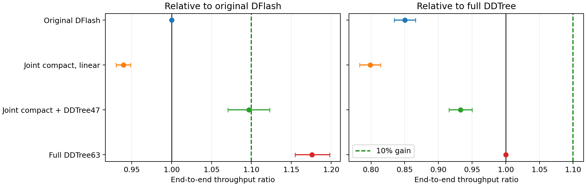
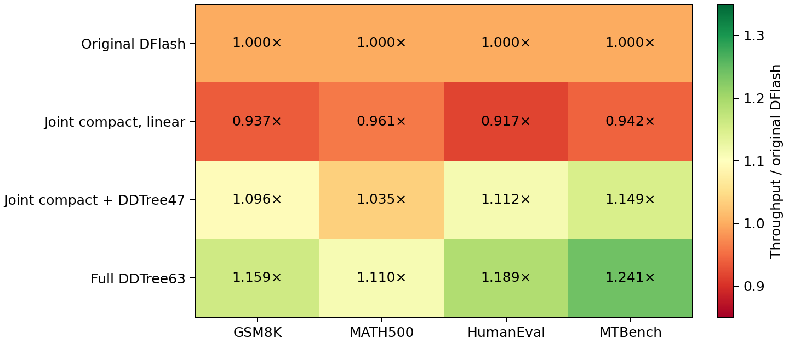

# Native speculative decoding: completed experiment decision

**The tested compact joint-training method does not improve on original DFlash. Existing DDTree does exceed the requested 10% throughput gain. None of the tested new extensions improves on full DDTree.** This is a bounded result for Qwen3-8B and this search, not a proof against all jointly trained native architectures.

The final candidate was frozen before evaluating 128 requests: 32 each from GSM8K, MATH500, HumanEval and MTBench. All four timed methods use the same frozen target, L40S hardware, BF16/SDPA runtime, greedy verification and a 2,048-token output cap. There are two rotated timing repeats per method/request, including prefill and decoder overhead, plus one untimed-for-comparison AR quality generation. The cap is a maximum; generation stops at EOS. The 128 requests were excluded from this standalone study's tuning but originated in an earlier project manifest, so globally unseen evaluation is not claimed.

## Final throughput

| Method | Tokens/s | Change vs original | Paired 95% ratio interval | Ratio vs full DDTree |
|---|---:|---:|---|---:|
| Original DFlash | 169.5 | +0.0% | [1.000, 1.000] | 0.850 |
| Joint compact, linear verification | 159.2 | -6.1% | [0.930, 0.948] | 0.799 |
| Joint compact + DDTree47 | 185.9 | +9.7% | [1.070, 1.123] | 0.933 |
| Full drafter + DDTree63 | 199.3 | +17.6% | [1.155, 1.198] | 1.000 |

The compact-plus-tree point estimate is below 10%, and its interval crosses the 10% threshold. Full DDTree's interval is entirely above that threshold. DDTree is prior art; this is an adapted heap-algorithm baseline in the shared runtime, not a reproduction of the complete upstream runtime or a new method claim. Intervals resample paired questions within workload and cluster timing repeats; they exclude fitting-seed uncertainty.

## Why the compact model loses

| Method | Mean accepted progress / round | Amortized wall time / round |
|---|---:|---:|
| Original DFlash | 6.342 | 37.34 ms |
| Joint compact, linear verification | 5.944 | 37.25 ms |
| Joint compact + DDTree47 | 7.693 | 41.30 ms |
| Full drafter + DDTree63 | 8.329 | 41.70 ms |

Removing three conditioning taps barely reduces complete round time, while accepted progress falls. The full tree spends more time per round but makes enough additional progress to win overall. These are aggregate wall-time/round values including amortized prefill, not isolated GPU kernel timings. An earlier instrumented development profile attributed approximately 80.5% of native time to the target backbone and vocabulary head; its CUDA-event spans include host-dispatch gaps.

## Output agreement and task quality

| Method | Exact original sequence /128 | Exact AR sequence /128 | Capped /128 |
|---|---:|---:|---:|
| Original DFlash | 128 | 40 | 1 |
| Joint compact, linear verification | 128 | 40 | 1 |
| Joint compact + DDTree47 | 42 | 40 | 1 |
| Full drafter + DDTree63 | 41 | 42 | 1 |

All timing repeats reproduce their own token sequences and acceptance traces exactly. Cross-decoder equality is much lower: even original DFlash exactly matches AR on only 40/128 outputs. Earlier diagnostics reproduced four fixed-tree divergences at the same true prefix, observed tied BF16 logits, and recovered equality through 512 tokens using FP32 parameters. That evidence supports numerical shape sensitivity in those selected cases; it does not establish the cause of every DDTree divergence or universal losslessness. Because outputs differ, these are throughput measurements on the same prompts, not timing of identical generated text.

| Method | GSM8K correct /32 | MATH500 correct /32 | HumanEval tests passed /32 |
|---|---:|---:|---:|
| Original DFlash | 28 | 30 | 31 |
| Joint compact, linear verification | 28 | 30 | 31 |
| Joint compact + DDTree47 | 27 | 29 | 31 |
| Full drafter + DDTree63 | 29 | 28 | 30 |
| AR quality reference | 29 | 30 | 30 |

Math uses the existing vendored Qwen2.5-Math extractor and grader; code runs the supplied HumanEval tests in an isolated sandbox. Dialogue has no ground-truth quality score. These small samples and standard code tests do not prove quality equivalence. Scoring protocol v1 encountered process kills on valid answers and is archived. All methods were rescored under the same v2 resource limits; resource failures are unscored, never treated as wrong answers. The final table requires zero unscored math/code outputs. See CONFIRMATION_QUALITY.md and quality-scored.json for raw extraction/test outcomes.

## Search completed before confirmation

- Joint compact fitting: 2/3/5 taps, 3/4/5 draft layers, data from 128 through 8,192 records, multiple update counts, learning rates, target/native KL, CE, hard/blended labels and position weights. The selected two-tap/five-layer native-KL checkpoint used 2,048 records and 1,024 updates; matched seed screens gave approximately 1.005, 0.991 and 0.989 times original throughput. The frozen confirmation selects one checkpoint, not a seed-averaged final comparison.
- Prediction changes: residual correction heads, accepted-prefix surrogates, prefix refiners, midpoint token injection, and coverage-aware fits. Improved local coverage or repaired individual predictions did not translate into a gain over the full DDTree control.
- Runtime and reuse policies: eager int4, compiled linears, windowed conditioning, vocabulary-head shortcuts, stale hints and proposal recycling. None established the requested gain.
- Tree verification: fixed full trees, restricted leaves, probability-selected trees, block horizons, temperatures, wider compact trees, history continuations and adaptive node budgets. Fixed-leaf gains weakened at the longer output cap. History and adaptive-budget extensions did not improve on full DDTree.

All pilot numbers remain development measurements with adaptive selection. Detailed positive and negative outcomes are retained in CORRECTED_RESULTS.md, PROGRESS_HEADS.md, RADICAL_RESULTS.md, TREE_RESULTS.md, TREE_REFERENCES.md, TREE_COVERAGE.md and the chronological PROGRESS.md. NATIVE_PRIOR_ART.md distinguishes related methods from baselines actually executed. No RelaySpec manuscript or reuse claim was changed.

## Decision and reproducibility

Do not promote compact joint training as a faster native method from these results. Use full DDTree63 as the measured performance baseline for future native research. A new experiment must earn an improvement over that stronger baseline and use newly reserved confirmation requests; this 128-request set is now consumed. Further work on branch-conditioned predictions would overlap existing JetSpec/Weaver/PCTree/DARTree work, so a new architecture requires explicit differentiation rather than another unqualified tree novelty claim.

The 16 confirmation waves completed successfully using at most four GPUs, with a maximum wave duration of 177 seconds and 2.14 allocated GPU-hours in total. The queue was checked empty after completion. All 34 local tests pass; frozen source and launcher hashes are unchanged. The selected checkpoint is copied locally with its SHA256 recorded in checkpoint-preservation.json. Reproduce the audit using analysis/README.md. Selection, manifests, configs, exact job IDs, runtime identities, raw outputs, scoring protocols and plots are retained in this standalone directory.
