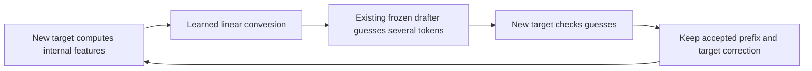

# RelaySpec submission review — 5 September 2026

**Verdict: promising underlying result; not submission-ready in its current form.** The most urgent work is to make the scientific claims agree with the implementation and recorded experiments. More model pairs alone will not resolve the current weaknesses. After the validity issues are repaired, the strongest submission is about cheaply retargeting existing, frozen, feature-conditioned speculative drafters and identifying when removing their original source transformer saves time.

This is a review, not a new experimental result or a prediction of acceptance. Findings refer to the working tree inspected on 5 September 2026, based at git commit `395f01f`, with substantial existing uncommitted work. I did not change the implementation or manuscript, submit jobs, or rerun large-model experiments. Remote checkpoint contents and the newest remote raw benchmark records were not independently inspected.

## 1. What the method actually does

A **target model** is the model whose answers we want. A **drafter**, also called a proposer, guesses several upcoming tokens so the target can check them together. A token is a small piece of text represented by an integer. Checking several good guesses together can take less time than asking the target to produce each token separately.

The difficulty here is that an existing DFlash or EAGLE-3 drafter expects internal features from the particular source model used during its training. Those features are vectors of numbers computed inside that source model. Reusing the drafter with a new target ordinarily requires running the old source transformer too.

RelaySpec learns a matrix that converts internal features already available from the new target into the input expected by the old drafter. The drafter's weights remain fixed. The target still decides which proposed tokens may become part of the answer.

The practical tradeoff is easy to understand: the conversion saves a source-model forward pass, but imperfect conversion can produce worse guesses and require more checking rounds. For example, a 20% reduction in work per round is insufficient if the decoder needs 40% more rounds. This is the useful organizing idea of the paper.

The source **transformer trunk** is removed from the relay path. Be precise about this: DFlash can retain source token embeddings and the output vocabulary projection as components used by the drafter. “Deletes the entire source model” is too broad.

## 2. Current evidence and what it supports

The current paired registry reports the following on the same 500 MATH-500 requests per model pair. “Plain decoding” means that the target generates without a speculative drafter. “Source reuse” means using the frozen drafter while still running its original source transformer. A 5× request-time ratio means the baseline took five times as much total time across the paired requests; it does not automatically mean five times as many tokens per second when output lengths differ.

| Frozen drafter family; new target | Relay versus plain decoding | Relay versus source reuse | Target-specific drafter versus plain decoding |
|---|---:|---:|---:|
| DFlash; Qwen3-8B | 5.018× [4.870, 5.174] | 1.531× | 5.559× |
| DFlash; Qwen3-14B | 5.143× [4.983, 5.298] | 1.268× | Not included |
| EAGLE-3; Qwen3-8B | 2.397× [2.332, 2.463] | 1.278× | 2.656× |
| EAGLE-3; Qwen3-14B | 2.625× [2.563, 2.688] | 1.097× | 2.945× |

The brackets are the registry's reported 95% bootstrap intervals: it repeatedly resamples whole requests to estimate uncertainty from the choice of requests. These intervals do not cover variation from fitting a new relay, choosing another checkpoint, or changing the serving engine. Source: [MAIN_PAIRED_AR.json](final/MAIN_PAIRED_AR.json). The newest local folders contain summary files rather than the raw per-request records needed to independently reconstruct these numbers.

There is substantial useful work beyond these four headline rows:

- Two substantially different drafter interfaces have working implementations. This is stronger than a single-model demonstration.
- Isolated EAGLE-3 memory runs report peak usage falling from 25.56 to 17.76 GiB for the 8B target and from 37.57 to 29.94 GiB for the 14B target. GiB measures memory capacity. These are separate memory experiments, not proof that every paired timing arm physically unloaded the source.
- The broader 16-cell task matrix has 11 improvements whose intervals are above source reuse, four regressions on 14B coding tasks, and one inconclusive comparison. This establishes a useful boundary, not a universal speed improvement. Those comparisons use source reuse, not plain decoding.
- The newer transfer registry contains promising 128-request results: approximately 4.92× for a Qwen-derived Nemotron target, 4.12× for the 14B-to-frozen-8B-relay adapter, 2.45× for a Llama-family replication, and 2.26× for a Qwen-to-Llama cross-tokenizer experiment. These interventions are different and must not all be called zero-shot reuse of the same map.
- The repository contains dataset manifests, historical source snapshots, separate memory tests, quality-scoring tools, acceptance analysis, and a meaningful test suite. These are a good foundation for an auditable submission.

The central claim worth preserving is: **an existing feature-conditioned drafter can sometimes be retargeted cheaply enough that avoiding its source transformer outweighs the loss in proposal quality.** The current evidence is weaker for universal transfer, a shared semantic basis, optimality of linear fitting, and behavior under continued target training.

## 3. Issues that must be resolved before submission

### R1 — The paper confuses agreement with source reuse and agreement with plain target decoding

**Severity: submission-blocking. Confirmed in the local summaries.**

The newest paired summaries report the following exact token-sequence agreement for RelaySpec:

| Target and drafter | Matches plain target decoding | Matches source reuse |
|---|---:|---:|
| DFlash 8B | 117/500, or 23.4% | 500/500 |
| DFlash 14B | 113/500, or 22.6% | 500/500 |
| EAGLE-3 8B | 135/500, or 27.0% | 497/500 |
| EAGLE-3 14B | 106/500, or 21.2% | 498/500 |

Evidence: `reports/final/{dflash-8b,dflash-14b,eagle3-8b,eagle3-14b}-pairedAR/benchmark-summary.json`, `src/relayspec/benchmarking.py`, and the correctness paragraphs in `paper/relayspec_v2/relayspec_iclr2027.tex`, approximately lines 301–314, 740–748, and the breadth caption.

The benchmark compares token-sequence hashes; calling this “exact text agreement” is not precise. Two token sequences can sometimes decode to the same displayed text. The paper must distinguish token equality, decoded-text equality, and task-answer correctness.

**What this does and does not mean:** target-specific native drafters and source reuse also have low agreement with plain decoding in these runs. Therefore this is not evidence that RelaySpec alone introduced all the mismatches. It is evidence that the paper has not established the claimed native-decoder equivalence. One near-tied-logit example cannot explain hundreds of requests.

**Required repair:** retrieve the raw outputs from these exact runs, compare actual target token IDs and decoded text, and score task answers under the same settings. For first divergences, compare the same committed prefix, token positions, attention mask, cached state, stopping rules, and target scores. Compare target evaluation one token at a time and in blocks, with controlled kernels and higher precision where useful. Group all observed causes and report their frequencies. A “numerical” explanation needs measurements, not an assumption.

Different tokenizers do not inherently authorize changed target answers. The current cross-family path converts proposals into target token IDs and verifies them. With an exact greedy target verifier and consistent state, the target still controls every committed token. Heterogeneous-tokenizer lossless decoding is established prior work; see [Timor et al., ICML 2025](https://proceedings.mlr.press/v267/timor25a.html). The basic speculative correctness argument is inherited from [Leviathan et al., ICML 2023](https://proceedings.mlr.press/v202/leviathan23a.html), not a new RelaySpec theorem.

### R2 — The written objective does not match both implementations; the closed-form comparison is not the same optimization problem

**Severity: submission-blocking for the method and ablation claims. Confirmed in code, with a CPU numerical counterexample.**

For DFlash, `project_source_interface` in `src/relayspec/proposers.py` applies the drafter's output normalization to the source projection. `scripts/train_relay.py`, around lines 627–631, also applies that normalization to the relay prediction before computing the loss. For EAGLE-3, the selected configuration uses a scale-preserving linear map, and the projected teacher is not this same normalized DFlash interface.

In simple terms, the DFlash training code compares vectors **after their lengths have been normalized**. The closed-form script fits the matrix **before normalizing its prediction**. These are different questions. A matrix that best solves one need not best solve the other.

To make the exact distinction explicit, define the following before writing the DFlash loss:

- `h` is one position's vector formed by joining the selected target-layer features.
- `N_in` is the input normalization actually used by the relay.
- `W` is the trainable relay matrix.
- `N_out` is the frozen DFlash output normalization.
- `c` is the source-derived teacher vector after that same output normalization.
- The squared length of a vector is the sum of its squared coordinates; it measures total numerical magnitude.

For each position, the DFlash training loss asks: **how far is the normalized relay prediction from the teacher, relative to the teacher's squared length?** Ignoring only the numerical lower bound on the denominator, it is

`squared_length(N_out(W N_in(h)) - c) / squared_length(c)`.

The closed-form script instead fits

`squared_length(W N_in(h) - c) / squared_length(c)`,

plus its configured ridge penalty, which discourages large matrix weights. Normalizing the output is a nonlinear operation on `W`, even though `W` itself is a linear layer. Reweighting the training examples by teacher length does not remove this difference. There are additional differences: the ridge setting is 1.0 while the selected gradient fit has zero weight decay, and pooling all token positions differs from averaging variable-length examples equally.

A small numerical check found a largest gradient component of about `1.06e-8` for the weighted least-squares objective at its solution, but `0.1385` for the post-normalization training objective at that same solution. A gradient measures how much the loss changes when a weight changes: the first is effectively stationary, while the second can still improve. This is a counterexample to objective equivalence, not a measurement on the trained large-model relay. See [math-checks.json](submission-review-2026-09-05/math-checks.json).

**Required repair:** write separate, exact consumed interfaces and losses for DFlash and EAGLE-3; state where normalization occurs. Either label ridge as a different fitting method/objective or construct a truly matched raw-linear comparison, including regularization and example weighting. Report training loss, held-out loss, and actual accepted tokens separately. Remove “optimal linear solution” implications for the current DFlash ablation.

The EAGLE-3 architecture appendix also reverses the direction of the design finding: `reports/design-selection/eagle3/ARCHITECTURE_SELECTION.md` attributes the improvement to preserving scale rather than adding input normalization. Dividing an error by the teacher's energy does not, by itself, make a loss direction-only. A vector twice as long as the teacher points in the same direction and still has nonzero raw relative error.

### R3 — The 8,192-example experiment uses only 4,096 distinct records

**Severity: high; confirmed from configuration and data loading.**

`configs/protocol_next/train_dflash_qwen3_8b_scale8192_4gpu.yaml` points to `configs/train_math_4096.json`, which contains 4,096 records. It sets 2,048 steps on four workers. `scripts/train_relay.py` cycles through the per-worker rows, so this setting presents the 4,096 records twice.

Reading the same 4,096 examples twice means 8,192 example presentations, not 8,192 distinct examples. Furthermore, the existing smaller-data settings also change the number of optimization steps. Therefore the curve mixes data quantity and training duration.

**Required repair:** immediately relabel the current experiment as a training-exposure curve. For a true data ablation, separately vary (a) distinct records at fixed update count and (b) updates at fixed records. Publish the manifest size, presentations, updates, maximum text length, and number of passes for every point. A genuine 8,192-record experiment requires a new, audited manifest.

### R4 — The “small adapter” has 524 million trainable weights

**Severity: high; confirmed by architecture dimensions.**

The 14B-to-frozen-8B-relay adapter is a dense conversion from 25,600 input coordinates to 20,480 output coordinates. A dense bias-free matrix stores one weight for every input/output pair, so its parameter count is `25,600 × 20,480 = 524,288,000`. A direct 14B relay has 65,536,000 weights. The adapter therefore adds eight times as many trainable weights as fitting the direct relay, while also retaining the frozen base relay.

Evidence: `src/relayspec/relay.py` and `configs/protocol_next/train_dflash_qwen3_14b_adapter_to_8b_4gpu.yaml`. That adapter configuration also uses SGD at learning rate 0.02, so the appendix cannot claim every fit uses the main AdamW setting at 0.0006.

**Required repair:** disclose the actual parameters, storage, fitting cost, and inference cost. Call the experiment reuse through a learned dense adapter, not cheap or parameter-free map transfer. Compare it with fitting the much smaller direct relay. If economical reuse matters, test a deliberately constrained adapter, such as two thinner matrices whose product performs the conversion.

### R5 — The nonlinear ablation changes capacity and structure as well as nonlinearity

**Severity: high for the conclusion, easy to narrow immediately.**

The 512-unit intermediate-layer network has 11,796,480 weights, versus 52,428,800 in the 8B linear relay. It also compresses every input through only 512 intermediate coordinates. This tests one specific smaller, compressed nonlinear network; it does not establish that nonlinear maps are worse in general.

**Required repair:** narrow the current statement to the tested architecture. A stronger comparison uses a two-matrix linear model with the same intermediate width, a similarly sized nonlinear model, and a small nonlinear correction added to the already-fitted linear relay. Report fitting time as well as parameters. Multiple fitting seeds are more useful here than more decimal places from one fit.

### R6 — The novelty table incorrectly says all relevant alternatives change drafter weights and retrain for each target

**Severity: submission-blocking for positioning; confirmed in primary sources.**

- **SD²:** the official paper includes a steering-only, frozen-drafter variant that increases accepted tokens. Its full method also studies drafter fine-tuning. The current “only frozen proposer” claim is false. Its five tasks with 96 examples each describe evaluation, not the amount of training data. Its reported gains also need the correct baseline. [AAAI 2026 paper](https://ojs.aaai.org/index.php/AAAI/article/view/40255), [full text](https://ojs.aaai.org/index.php/AAAI/article/view/40255/44216).
- **PARD:** the target-independent setting is explicitly intended to reuse a drafter across targets without separate training for each. Initial universal-drafter training cost is not marginal cost per new target. [ICLR 2026 paper](https://openreview.net/pdf?id=XbOyv7iVGL). [PARD-2](https://arxiv.org/abs/2605.08632) also separates target-independent and target-dependent settings.
- **Model stitching:** learning a small connector between frozen models is an established idea, including [Bansal et al., NeurIPS 2021](https://papers.nips.cc/paper/2021/hash/01ded4259d101feb739b06c399e9cd9c-Abstract.html). The new contribution must be the speculative-decoding use, interface contracts, costs, and evidence, not inventing frozen-model linear alignment.

**Required repair:** rebuild the table with separate columns for original drafter creation, additional fitting for a new target, which weights change, required source-model execution, supported interfaces/tokenizers, and demonstrated quality preservation. Published speedups from different hardware or serving engines are context, not a ranking.

A defensible distinction is: “We transplant the conditioning interface of an already-released, feature-conditioned drafter to a new target, keeping the drafter fixed and removing the original source transformer from the relay decoding path.” Test that distinction against the closest frozen steering and inexpensive adaptation baselines; do not claim an unverified universal first.

### R7 — The current drift checkpoint exporter fails a basic save/reload test

**Severity: submission-blocking for drift conclusions and the planned drift research direction. Locally reproduced; remote artifact causation is not established.**

`scripts/lora_sft_drift.py:64` calls `merge_adapter()`, then saves `peft_model.base_model.model`, then unmerges. Merging updates the numerical base weights but leaves the adapter wrappers installed. In a small Qwen3 model, this export saves names such as `q_proj.base_layer.weight`, while the ordinary model loader expects `q_proj.weight`.

Using the same export sequence, with no adapter training at all, the ordinary loader reported eight missing weights and 24 unexpected entries; attention projections were reinitialized. The largest change in an output score was about 0.2268. Exporting a correctly unloaded merged copy produced zero missing entries, zero unexpected entries, and zero score difference. Environment: PEFT 0.13.2, Transformers 5.15.1, PyTorch 2.13.0+cu130. See [checkpoint-check.json](submission-review-2026-09-05/checkpoint-check.json).

This shows a real defect in the local export path. It does **not** prove which code produced each remote checkpoint, or that it explains all observed drift. The current decision register's collapse results must remain unvalidated until those artifacts are checked.

**Required repair:** inspect the actual remote source snapshot, environment, checkpoint keys, and loading warnings. Require an untrained save/reload round trip to preserve scores and decoded outputs before evaluating training drift. For continuing training, export the adapter and merge it into a fresh base model in a separate export step; do not permanently unload the training model. Avoid repeatedly mutating low-precision base weights during distributed training, because merge/unmerge can also introduce rounding changes. Follow the [official PEFT checkpoint guidance](https://huggingface.co/docs/peft/developer_guides/checkpoint).

Do not spend the remaining submission window developing increasingly complicated drift correction around potentially invalid checkpoints. Even valid failure of one low-rank or nonlinear correction at one budget does not prove that no correction can work.

### R8 — The newest figures and tables do not have one reconstructible source of truth

**Severity: high. Confirmed local artifact gap and mixed data flow.**

The paired-AR registries reference recent jobs, but the matching local directories contain only summaries. The transfer registry also points to remote evidence. Historical raw runs are abundant, but they are not substitutes for the newest headline records.

`scripts/build_iclr_paper_assets.py` loads the new paired ratios for some labels while constructing throughput coordinates from older `main_math` and `native_controls` data. Thus the figure can show a new ratio next to points from different runs. The difference between total request-time ratios and tokens-per-second ratios adds another opportunity for confusion.

**Required repair:** archive raw per-request records, scored answers, run configuration, model revisions, source snapshot, and manifest hashes for every main claim. Generate summaries, intervals, tables, and figure coordinates from those records through one documented pipeline. Every comparison needs an explicit baseline. Preserve different experiment types, but label them as different runs.

### R9 — “Unlabeled prompts,” “under two minutes,” and “1,172× less data” overstate what was measured

**Severity: high for fair cost reporting.**

`encode_example` in `scripts/train_relay.py:55` renders the MATH problem and its assistant solution, then truncates the text. There is no direct answer-prediction loss, but the fitting inputs are not exclusively solution-free prompts. Describe them as problem–solution texts supervised through frozen-model features, and disclose that distinction.

The fitting timer starts after model loading. Approximately 86–119 seconds on four GPUs is a useful warm fitting-loop measurement, not complete startup-to-deploy time. Report GPU-seconds, startup/loading separately, and whether feature extraction is inside the timer. Four training workers do not mean an individual decoding request was split across four GPUs.

The large data-reduction factor compares DFlash's repeated training exposure with RelaySpec's example presentations. If DFlash uses 800,000 distinct records and RelaySpec uses 4,096, the distinct-record ratio is about 195, not 1,172. Multiple passes explain the larger exposure ratio, while different text lengths and computation per example prevent treating either ratio as a compute speedup. Separate inherited drafter creation from marginal retargeting cost on both sides. [DFlash full paper](https://arxiv.org/html/2602.06036v2).

### R10 — The timing analysis is primarily an explanation using observed measurements, not a demonstrated advance forecast

**Severity: medium to high; narrow the claim or run a true held-out test.**

`scripts/build_breadth_matrix.py` computes diagnostics using the candidate's acceptance and timing measurements from the workload being explained. The reported 16/16 sign agreement and approximately 0.34% error are useful accounting checks. They do not show that the method predicted the winner before observing candidate behavior.

The simplified break-even rule also assumes sufficiently stable costs per checking round and comparable output lengths. “Exactly when” should be qualified by those assumptions.

**Required repair:** call the existing calculation an observed-cost diagnostic. For prediction, estimate costs on a separate calibration subset, fix the rule, and test on unseen requests or tasks. Record errors and wrong decisions, not only a fitted line. A source-reuse fallback also requires the source to remain available or be loaded again; it cannot simultaneously guarantee permanent source removal.

## 4. Further issues that affect interpretation

| ID | Issue and evidence | Practical fix |
|---|---|---|
| R11 | The transfer rows combine an unchanged map, a newly learned 524M-weight adapter, a different drafter with a newly fitted map, and a cross-tokenizer protocol. | Add a transfer table listing original drafter, new target, reused weights, new trainable weights, fitting data, tokenizer conversion, and quality evidence. Only call the unchanged-map case zero-shot. |
| R12 | High similarity between relays trained toward a common teacher is not proof that different target models preserve the same semantic basis. A successful connector can exist without matching internal meanings. | Treat geometry as descriptive. Add independent held-out domains, simple random/permuted controls, and a relationship between feature errors and proposal rejection before claiming a mechanism. [Smith et al., ICML 2025](https://proceedings.mlr.press/v267/smith25a.html) explains why stitching-based alignment can mislead. |
| R13 | The broader task matrix contains real regressions, and its baseline differs from the main table. Older 4,680-pair quality comparisons are primarily relay versus source reuse, not new native-AR correctness evidence. | Retain the negative cells, label denominators, and score the current decoder arms. Complete plain-AR breadth or explicitly narrow the broader claim to source-reuse comparisons. |
| R14 | The similarity audit is described as character-level, but `scripts/audit_prompt_similarity.py` uses overlap of sets of lowercased words, numbers, and punctuation. It ignores order. Some training/evaluation pairs have very high overlap. | Describe the actual measure. Manually examine near duplicates, including solution text, and perform a clean-subset sensitivity analysis. High overlap flags inspection; it is not proof of leakage by itself. |
| R15 | Development and evaluation history includes repeatedly inspected MATH subsets. Older “confirmatory” splits do not automatically remain untouched after later design selection. | Build a ledger of every dataset subset used to select normalization, architecture, training steps, and transfer settings. Freeze a genuinely unexposed final test or honestly label existing results as development evaluation. |
| R16 | Single-fit bootstrap intervals describe prompt variation, not fitting stability. | Repeat a small number of representative fits with at least three seeds if feasible; report mean and range or seed-level uncertainty separately. Do not pool all requests as independent new fits. |
| R17 | The local drift plan moves toward a fast correction plus slower adaptation strategy without accounting for very recent related work. | Reconsider after checkpoint validation and compare against SpecRoll before claiming a new adaptive framework. See the literature map below. |
| R18 | Repo status documents and the visual approval record are stale. | Refresh them only after final artifacts are generated and actually inspected. The review run of `.venv/bin/python -m pytest -q` gave **189 passed, 2 failed**. Both failures concern the manuscript audit's stale visual-review record, not a passed final submission state. |

The PDF inspected has 16 pages, with the main text ending on page 9. I rendered all pages and visually inspected main pages 1–9. The title breaks “Proposer” across lines, and some late main-text tables and labels are dense. The current visual-review JSON refers to a different 17-page PDF and an old hash; it must not be silently approved for the new PDF. The current audit checks otherwise provide useful format coverage, but passing syntax or style checks cannot validate the scientific claims above.

## 5. Related-work map and what it changes

This is a targeted search of the closest work and important recent follow-ups, not a claim to have read every speculative-decoding paper ever published. Prefer the official conference version where available. ArXiv-only entries below are identified as preprints rather than treated as accepted papers.

| Work | Connection to RelaySpec | Consequence for this submission |
|---|---|---|
| [DFlash, ICML 2026](https://arxiv.org/abs/2602.06036) | The source of one frozen feature-conditioned drafter interface. | Specify the exact checkpoint, normalization, embeddings/head, training inheritance, and serving differences. |
| [EAGLE-3, NeurIPS 2025](https://proceedings.neurips.cc/paper_files/paper/2025/hash/c7b5a35ea98b62512a869c19ea7b03cb-Abstract-Conference.html) | The second, structurally different drafter interface. | Explain its scale-preserving contract rather than forcing it into DFlash's equation. |
| [SD², AAAI 2026](https://ojs.aaai.org/index.php/AAAI/article/view/40255) | Target-informed steering includes a frozen-drafter variant. | Closest challenge to “only frozen”; distinguish steering an ordinary drafter from replacing an existing feature interface. |
| [PARD, ICLR 2026](https://openreview.net/pdf?id=XbOyv7iVGL); [PARD-2, 2026 preprint](https://arxiv.org/abs/2605.08632) | Reuse across targets includes target-independent drafting. | Compare marginal new-target cost fairly; universal creation cost is a separate column. |
| [OmniDraft, NeurIPS 2025](https://arxiv.org/abs/2507.02659) | One drafter serves heterogeneous targets with online adaptation and vocabulary handling. | Discuss the difference between fixed-drafter reuse and online distillation; cross-tokenizer reuse is not new by itself. |
| [EDA, 2026 preprint](https://arxiv.org/abs/2603.09527) | Efficient adaptation of speculative drafters, with hidden-state-informed data selection and adaptation baselines. | Strong motivation for a matched low-cost retargeting comparison, not only from-scratch training counts. |
| [HyperDFlash, 2026 preprint](https://arxiv.org/abs/2606.26744) | Learns how target-layer information feeds a DFlash-style drafter. | Explain what is fixed in RelaySpec and distinguish interface transfer from learning better target-specific conditioning. |
| [Model stitching, NeurIPS 2021](https://papers.nips.cc/paper/2021/hash/01ded4259d101feb739b06c399e9cd9c-Abstract.html); [Functional Alignment Can Mislead, ICML 2025](https://proceedings.mlr.press/v267/smith25a.html) | Frozen models connected by learned transformations; limits of interpreting successful alignment. | Cite the conceptual precedent and narrow semantic-basis claims. |
| [CrossModelKV, August 2026 preprint](https://arxiv.org/abs/2608.03893) | Cross-model linear mapping of cached internal representations for prefill reuse. | Distinguish the inference stage and objective. A successful linear fit alone is not a new general representation principle. |
| [KVShot, 2026 preprint](https://arxiv.org/abs/2604.26412) | Uses cache information for long-range speculative decoding. | The paper should not classify all cache-transfer work as addressing only the first prompt pass. |
| [Heterogeneous-vocabulary speculative decoding, ICML 2025](https://proceedings.mlr.press/v267/timor25a.html) | Different tokenizers can be handled while preserving the target output distribution. | Repair the claim that tokenizer differences inherently give up exactness. |
| [VSD, 2026 preprint](https://arxiv.org/abs/2602.05774); [DraftOPD, 2026 preprint](https://arxiv.org/abs/2605.29343) | Train for better acceptance or use states encountered during actual speculative decoding. | Useful next step if feature error fails to predict proposal quality; not necessary to add before basic correctness is resolved. |
| [OnlineSPEC, ICML 2026 record](https://arxiv.org/abs/2603.12617); [FastGRPO, ICLR 2026](https://openreview.net/pdf?id=zuGt6TYYtS); [SpecRoll, August 2026 preprint](https://arxiv.org/abs/2608.04962) | Adaptation during changing-target or reinforcement-learning workloads. SpecRoll combines fast state correction with slower learned updates. | The future fast/slow drift plan has direct prior art. A static batch-one MATH experiment cannot establish an advantage in concurrent training rollouts. |
| [SPEED-Bench, ICML 2026 record](https://arxiv.org/abs/2604.09557) | Systematic evaluation across workloads and execution settings. | State hardware, engine, output lengths, warmup, and concurrency. If time permits, one optimized-engine validation adds more external credibility than several extra same-engine model pairs. |

The [official Nemotron-Orchestrator-8B model card](https://huggingface.co/nvidia/Nemotron-Orchestrator-8B) identifies a Qwen3-8B base and reinforcement-learning post-training. That is useful evidence about this particular descendant. It does not establish robustness to arbitrary fine-tuning or online reinforcement-learning workloads.

## 6. What would make this an appreciably stronger paper

The highest-value missing comparison answers: **if we already have a trained drafter and a small adaptation budget, is fitting RelaySpec a better use of that budget than cheaply adapting the drafter?**

Use identical fitting records and comparable measured GPU time to compare the frozen-drafter relay with a small drafter update, selective-layer update, or a faithful relevant steering baseline. Keep the source-reuse and available target-specific drafter controls. Plot adaptation cost against measured decoding time and memory. Separate one-time inherited pretraining from new-target fitting. It is acceptable for the target-specific drafter to be faster: the proposed benefit is obtaining much of that performance without its marginal adaptation cost.

For understanding the method, the most valuable controlled experiment is the normalization/interface comparison, followed by distinct data versus updates, then matched-capacity map comparisons. A gallery of extra model names cannot substitute for these controls.

For generalization, test one newly held-out text domain and preserve the existing negative coding cases. A clean second-family replication is valuable, but mark which drafter and map are newly fitted. Cross-tokenizer claims should be secondary until the native-decoder equality question is resolved.

For the systems argument, separate an observed-cost explanation from a genuine forecast. Use a small calibration set to decide whether to use the relay and evaluate that decision on unseen requests. Include the cost and residency implications of switching back to source reuse.

For longer-term work, only after validating saved targets, study adaptation to changed target behavior. Track target quality, source-reuse acceptance, relay acceptance, and feature error together. If source reuse also collapses, an input map alone may not address all of the failure; that is a hypothesis to test, not a proof of impossibility. Compare against SpecRoll and online-adaptation work before introducing an elaborate new framework.

## 7. Suggested paper framing and reviewer outlook

Suggested title: **“RelaySpec: Retargeting Frozen Speculative Drafters with Linear Interfaces.”**

The abstract should state the dependency problem, exactly what is trained, measured marginal fitting cost, the speed/memory tradeoff, and the tested boundaries. Remove unsupported superlatives, the incorrect data multiplier, and the implication that all transfer settings reuse one unchanged map. Explain target verification accurately and separately from observed implementation agreement.

A clear nine-page main narrative is: problem and closest prior art; exact family-specific interfaces; fair paired performance and quality; adaptation cost comparisons; controlled ablations; generalization and failure boundaries; limitations. Put exhaustive configurations and extra traces in the appendix, but keep correctness and the main negative results visible.

My reviewer-style assessment is:

- **Importance:** credible. Reusing expensive-to-build drafters and avoiding an extra transformer pass is a meaningful problem.
- **Technical novelty:** potentially sufficient as an empirical and systems contribution, but overstated relative to steering, universal drafting, and model stitching.
- **Soundness:** currently insufficient because crucial written claims disagree with code and recorded comparisons.
- **Evidence:** considerable work exists, but the latest main results need complete provenance, native-target quality/equality analysis, and fair adaptation controls.
- **Clarity:** the main intuition is strong; the unified normalization argument and shifting comparison baselines make the current explanation misleading.
- **Likely review concern if unchanged:** rejection on soundness and positioning, even if the speed measurements are real. Repairing those issues would materially improve the submission; no review can guarantee acceptance.

## 8. Submission logistics and evidence boundaries

The official [ICLR 2027 call](https://iclr.cc/Conferences/2027/CallForPapers) lists abstract registration on **18 September 2026, 23:59 Anywhere on Earth**, and full submission on **25 September 2026, 23:59 Anywhere on Earth**. In India these are **19 September and 26 September at 17:29 IST**, respectively. Aim to finish earlier. The [author guidelines](https://iclr.cc/Conferences/2027/AuthorGuidelines) specify the main-text format and AI-use disclosure requirements; use the official 2027 materials for the final check.

Read for this review: the complete current TeX manuscript, main repository documentation, generation/training/proposer/relay/benchmark code paths, active and relevant next-stage configurations, main and transfer registries, design-selection and breadth reports, recent decision register/plans, manuscript asset/audit tooling, and primary literature listed above. I did not individually inspect every historical raw request, reproduce GPU benchmarks, or establish the contents of remote checkpoints. Main PDF pages 1–9 were visually inspected; all 16 were rendered. The test suite was run once during this review, with the outcome recorded above.

Small local checks are archived in [submission-review-2026-09-05](submission-review-2026-09-05). The prioritized execution plan is [the accompanying repair plan](../docs/plans/2026-09-05-iclr-submission-repair-plan.md).
