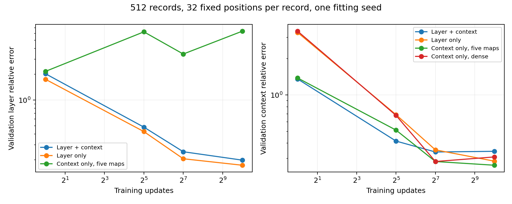

# User-proposed layer + context loss: controlled test

DFlash4B drafter retargeted to Qwen3-8B. Four arms use512 training and128 validation records,32 fixed sampled positions per record,2048-position batches,AdamW lr0.0006 with zero decay,seed1729. Five bias-free4096→2560 maps and fixed source fusion/RMSNorm implement the requested joint objective with equal weights and denominator epsilon1e-6. The dense control uses the existing normalized dense architecture. Every arm has52,428,800 trainable weights. Frozen cached sequences are capped at192 tokens; this does not reproduce a512/4k rollout-length study.

All four arms share identical record/token-position selection. Source taps are regenerated from the cached token IDs. Eight reconstructed teacher checks have relative error below0.00002. Folding five maps into the deployment projection is algebraically checked inFP32; BF16 folding need not be bitwise identical to a two-stage computation.

## Short screens

| Arm |128-update retention |1024-update retention |
|---|---:|---:|
|Layer + context|83.24%|88.22%|
|Layer only|76.66%|94.13%|
|Context only, five maps|83.69%|96.09%|
|Context only, dense|91.70%|95.26%|

Both eight-question screens use the same exposed GSM8K questions. Retention is relative to each worker’s original8192-update RelaySpec reference. All outputs score8/8, no caps. Cross-worker candidate rankings are exploratory.

## Paired32-question endpoint comparison

| Arm |Tokens/s |Reference retained [95% CI] |Correct |At cap |
|---|---:|---|---:|---:|
|Existing RelaySpec8192-update reference|152.13|100.00% [100.00,100.00]|30/32|0|
|Context only, five maps|142.74|93.83% [91.65,96.15]|30/32|0|
|Context only, dense|140.78|92.54% [90.55,94.61]|30/32|0|
|Layer + context|132.33|86.99% [84.74,89.17]|30/32|0|
|Layer only|141.10|92.75% [90.50,94.94]|30/32|0|

All four1024-update candidates and the original reference run within each worker on identical questions.32 exposed development requests, four8-question shards,2048token cap. Earlier8 are a subset, not an additional independent sample. Confidence intervals resample paired requests and exclude fitting-seed and selection uncertainty. No quality noninferiority claim.

The equal-weight joint loss is13.0% slower than the existing reference,6.0% slower than the matched-budget dense control, and7.3% slower than context-only with the same five-map structure. Joint/dense ratio0.9400[0.9230,0.9586], joint/context-only0.9271[0.9095,0.9457]. Every method produces identical tokens and scores30/32, with no caps. This experiment does not justify replacing the baseline.

