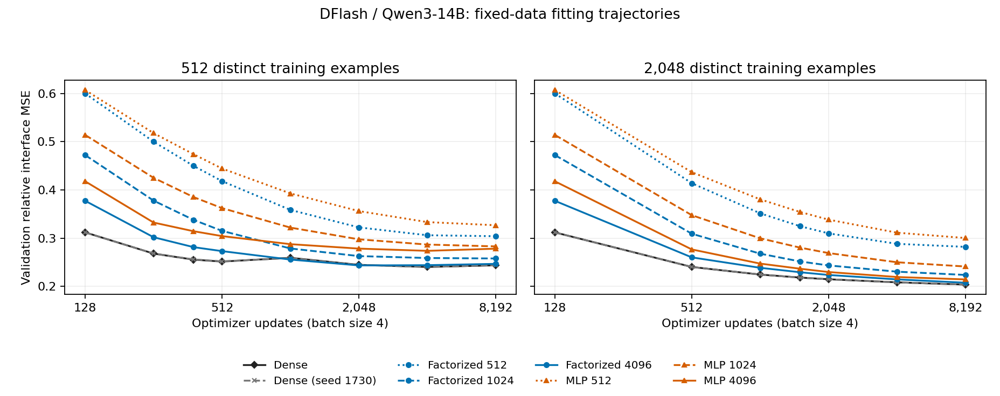

# DFlash 14B fitting diagnostics

All 16 fits passed the raw-log audit. Training uses 512 or 2,048 distinct examples, 8,192 batch-four updates and the same 1,024-record validation set. No larger-data scaling is resumed. These are feature-fitting measurements, not decoding rankings or answer-quality claims.

Step 0 is omitted from the plot for readability and retained in the registry. Both dense fitting seeds are shown separately. Feature-validation minima do not change the fixed 8,192-update decoding endpoint.

| N | Mapper | Seed | Parameters (M) | Train loss | Validation loss | Best saved step | Update seconds | Total worker seconds |
|---:|---|---:|---:|---:|---:|---:|---:|---:|
| 512 | Dense | 1729 | 65.536 | 0.15323 | 0.24389 | 4096 | 252.09 | 325.81 |
| 512 | Dense | 1730 | 65.536 | 0.15310 | 0.24397 | 4096 | 234.35 | 307.40 |
| 512 | Factorized 512 | 1729 | 14.418 | 0.25095 | 0.30420 | 8192 | 166.78 | 230.75 |
| 512 | Factorized 1024 | 1729 | 28.836 | 0.17987 | 0.25805 | 8192 | 155.15 | 217.40 |
| 512 | Factorized 4096 | 1729 | 115.343 | 0.15478 | 0.24691 | 2048 | 296.97 | 396.88 |
| 512 | MLP 512 | 1729 | 14.418 | 0.27695 | 0.32695 | 8192 | 162.64 | 231.55 |
| 512 | MLP 1024 | 1729 | 28.836 | 0.20825 | 0.28313 | 8192 | 171.16 | 232.00 |
| 512 | MLP 4096 | 1729 | 115.343 | 0.13972 | 0.27839 | 4096 | 300.87 | 384.98 |
| 2048 | Dense | 1729 | 65.536 | 0.18802 | 0.20396 | 8192 | 269.38 | 370.95 |
| 2048 | Dense | 1730 | 65.536 | 0.18796 | 0.20390 | 8192 | 254.85 | 365.70 |
| 2048 | Factorized 512 | 1729 | 14.418 | 0.27413 | 0.28213 | 8192 | 187.74 | 278.77 |
| 2048 | Factorized 1024 | 1729 | 28.836 | 0.21163 | 0.22398 | 8192 | 173.39 | 260.96 |
| 2048 | Factorized 4096 | 1729 | 115.343 | 0.19309 | 0.20784 | 8192 | 326.86 | 438.20 |
| 2048 | MLP 512 | 1729 | 14.418 | 0.29188 | 0.30046 | 8192 | 177.13 | 269.75 |
| 2048 | MLP 1024 | 1729 | 28.836 | 0.22674 | 0.24144 | 8192 | 184.53 | 283.96 |
| 2048 | MLP 4096 | 1729 | 115.343 | 0.17439 | 0.21467 | 8192 | 328.96 | 448.81 |

Train loss uses the declared 256-record diagnostic prefix; validation uses all 1,024 records. Worker time includes setup, initial and checkpoint validation, input preparation, fitting and export. Four independent fits share each allocation; sum of worker times is not batch wall time.

Widths 512/1,024/4,096 have 14.418/28.836/115.343 million parameters in both factorized linear and MLP maps; dense has 65.536 million. A linear width above output dimension 2,560 does not increase its maximum function-class rank.

## Late validation changes

| N | Mapper | Seed | Minimum saved loss | Endpoint loss | Endpoint change from minimum |
|---:|---|---:|---:|---:|---:|
| 512 | Dense | 1729 | 0.24051 | 0.24389 | +1.40% |
| 512 | Dense | 1730 | 0.24053 | 0.24397 | +1.43% |
| 512 | Factorized 512 | 1729 | 0.30420 | 0.30420 | +0.00% |
| 512 | Factorized 1024 | 1729 | 0.25805 | 0.25805 | +0.00% |
| 512 | Factorized 4096 | 1729 | 0.24371 | 0.24691 | +1.31% |
| 512 | MLP 512 | 1729 | 0.32695 | 0.32695 | +0.00% |
| 512 | MLP 1024 | 1729 | 0.28313 | 0.28313 | +0.00% |
| 512 | MLP 4096 | 1729 | 0.27389 | 0.27839 | +1.64% |
| 2048 | Dense | 1729 | 0.20396 | 0.20396 | +0.00% |
| 2048 | Dense | 1730 | 0.20390 | 0.20390 | +0.00% |
| 2048 | Factorized 512 | 1729 | 0.28213 | 0.28213 | +0.00% |
| 2048 | Factorized 1024 | 1729 | 0.22398 | 0.22398 | +0.00% |
| 2048 | Factorized 4096 | 1729 | 0.20784 | 0.20784 | +0.00% |
| 2048 | MLP 512 | 1729 | 0.30046 | 0.30046 | +0.00% |
| 2048 | MLP 1024 | 1729 | 0.24144 | 0.24144 | +0.00% |
| 2048 | MLP 4096 | 1729 | 0.21467 | 0.21467 | +0.00% |

These descriptive minima come from exposed feature validation. Small increases can reflect optimization fluctuations; comparisons of selected minima do not establish a decoding improvement. Wide-model learning-rate checks and paired endpoint decoding remain separate.
