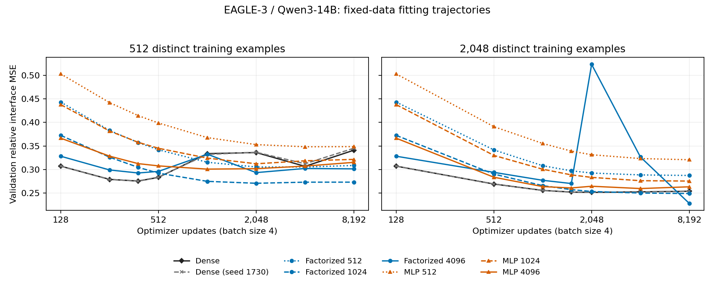

# EAGLE-3 14B fitting diagnostics

All 16 fits passed the raw-log audit. Training uses 512 or 2,048 distinct examples, 8,192 batch-four updates and the same 1,024-record validation set. No larger-data scaling is resumed. These are feature-fitting measurements, not decoding rankings or answer-quality claims.

Step 0 is omitted from the plot for readability and retained in the registry. Both dense fitting seeds are shown separately. Feature-validation minima do not change the fixed 8,192-update decoding endpoint.

| N | Mapper | Seed | Parameters (M) | Train loss | Validation loss | Best saved step | Update seconds | Total worker seconds |
|---:|---|---:|---:|---:|---:|---:|---:|---:|
| 512 | Dense | 1729 | 65.536 | 0.23418 | 0.34090 | 384 | 227.45 | 310.61 |
| 512 | Dense | 1730 | 65.536 | 0.23834 | 0.34508 | 384 | 219.20 | 300.63 |
| 512 | Factorized 512 | 1729 | 14.418 | 0.25587 | 0.30850 | 4096 | 154.73 | 212.41 |
| 512 | Factorized 1024 | 1729 | 28.836 | 0.19698 | 0.27302 | 2048 | 185.55 | 253.68 |
| 512 | Factorized 4096 | 1729 | 115.343 | 0.22581 | 0.30131 | 384 | 299.91 | 381.90 |
| 512 | MLP 512 | 1729 | 14.418 | 0.30215 | 0.34852 | 4096 | 162.58 | 225.03 |
| 512 | MLP 1024 | 1729 | 28.836 | 0.25312 | 0.32141 | 2048 | 176.09 | 233.38 |
| 512 | MLP 4096 | 1729 | 115.343 | 0.22413 | 0.31511 | 1024 | 307.85 | 392.80 |
| 2048 | Dense | 1729 | 65.536 | 0.23123 | 0.25371 | 2048 | 222.95 | 313.07 |
| 2048 | Dense | 1730 | 65.536 | 0.23141 | 0.25389 | 2048 | 234.61 | 321.76 |
| 2048 | Factorized 512 | 1729 | 14.418 | 0.27917 | 0.28724 | 8192 | 174.37 | 260.75 |
| 2048 | Factorized 1024 | 1729 | 28.836 | 0.23614 | 0.24885 | 8192 | 179.97 | 259.69 |
| 2048 | Factorized 4096 | 1729 | 115.343 | 0.21629 | 0.22787 | 8192 | 309.37 | 409.76 |
| 2048 | MLP 512 | 1729 | 14.418 | 0.31095 | 0.32064 | 8192 | 167.04 | 261.97 |
| 2048 | MLP 1024 | 1729 | 28.836 | 0.25929 | 0.27532 | 8192 | 171.44 | 260.52 |
| 2048 | MLP 4096 | 1729 | 115.343 | 0.22745 | 0.26317 | 4096 | 284.86 | 377.08 |

Train loss uses the declared 256-record diagnostic prefix; validation uses all 1,024 records. Worker time includes setup, initial and checkpoint validation, input preparation, fitting and export. Four independent fits share each allocation; sum of worker times is not batch wall time.

Widths 512/1,024/4,096 have 14.418/28.836/115.343 million parameters in both factorized linear and MLP maps; dense has 65.536 million. A linear width above output dimension 2,560 does not increase its maximum function-class rank.

## Late validation changes

| N | Mapper | Seed | Minimum saved loss | Endpoint loss | Endpoint change from minimum |
|---:|---|---:|---:|---:|---:|
| 512 | Dense | 1729 | 0.27534 | 0.34090 | +23.81% |
| 512 | Dense | 1730 | 0.27564 | 0.34508 | +25.19% |
| 512 | Factorized 512 | 1729 | 0.30517 | 0.30850 | +1.09% |
| 512 | Factorized 1024 | 1729 | 0.27066 | 0.27302 | +0.87% |
| 512 | Factorized 4096 | 1729 | 0.29250 | 0.30131 | +3.01% |
| 512 | MLP 512 | 1729 | 0.34822 | 0.34852 | +0.08% |
| 512 | MLP 1024 | 1729 | 0.31209 | 0.32141 | +2.99% |
| 512 | MLP 4096 | 1729 | 0.30071 | 0.31511 | +4.79% |
| 2048 | Dense | 1729 | 0.25121 | 0.25371 | +1.00% |
| 2048 | Dense | 1730 | 0.25123 | 0.25389 | +1.06% |
| 2048 | Factorized 512 | 1729 | 0.28724 | 0.28724 | +0.00% |
| 2048 | Factorized 1024 | 1729 | 0.24885 | 0.24885 | +0.00% |
| 2048 | Factorized 4096 | 1729 | 0.22787 | 0.22787 | +0.00% |
| 2048 | MLP 512 | 1729 | 0.32064 | 0.32064 | +0.00% |
| 2048 | MLP 1024 | 1729 | 0.27532 | 0.27532 | +0.00% |
| 2048 | MLP 4096 | 1729 | 0.25944 | 0.26317 | +1.44% |

These descriptive minima come from exposed feature validation. Small increases can reflect optimization fluctuations; comparisons of selected minima do not establish a decoding improvement. Wide-model learning-rate checks and paired endpoint decoding remain separate.
